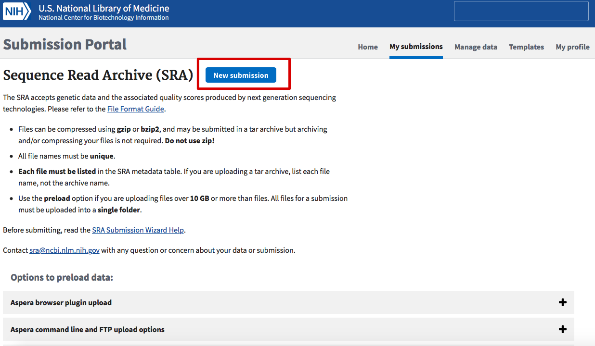
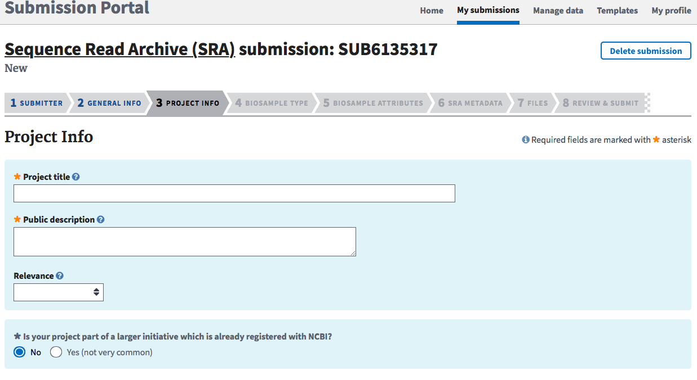

Sequence submission tutorial
================
Maxime Sweetlove
october 2019

High throughput sequencing have revolutionized the way we study natural microbial communities, and typically generates large amounts of data at relatively low cost and limited time investment. Even after the data has been thoroughly analyzed and the findings published, it still remains highly valuable to the rest of the scientific community, to e.g. compare results with, use as a reference for species??? geographic occurrence, or help to answer all sorts of questions related to time and space that is not achievable within a single study. In the spirit of transparency and collaborative science, the DNA sequences can be made openly available in the public sequence repositories of the [International Nucleotide Sequence Database Collaborative (INSDC)](http://www.insdc.org), which is the joint venture of the [European Nucleotide Archive (ENA)](https://www.ebi.ac.uk/ena), the American [National Center for Biotechnology Information (NCBI)](https://www.ncbi.nlm.nih.gov/nucleotide/) and the Japanese [DNA Databank of Japan (DDBJ)](https://www.ddbj.nig.ac.jp) databases. Since all three databases daily exchange their information, submitting sequences to one database makes them available on all three.

Having the sequences of a study publicly available is commonly a minimal requirement to publish in most journals, and to register a dataset on the [microbial Antarctic Resource System (mARS)](https://www.biodiversity.aq/mars).

However, uploading those sequences to one of the INSDC databases is not always straightforward, and can be complicated and confusing for new users because it requires a basic understanding of data formats, specific terminology and standardized data vocabularies.

This tutorial will guide you through the steps of submitting sequence data to INSDC. More specifically, we will focus on short read data, generated by high throughput sequencing, like metabarcode sequencing (synonym: amplicon or marker sequencing) and whole genome shotgun sequencing. We will focus on submitting data to the SRA database on NCBI (see therminology).

### How to use this tutorial

The best way to use this tutorial, is to have a quick read-through before you start, and then follow it step by step while simultaneously running through the protocol with your own dataset.

Disclaimer: - This tutorial was made by the mARS team of the Royal Belgian Institute of Natural Sciences, and is not an official INSDC document. - NCBI and GSC continuously develop their websites and standards to meet the present needs of the scientific community. This means that topics discussed in this tutorial may become outdated. If so, please contact us (<msweetlove@naturalsciences.be> or <avandeputte@naturalsciences.be>) so we can update the tutorial.

### Important terminology

-   [BioProject](https://www.ncbi.nlm.nih.gov/bioproject): A BioProject (represented by a unique BioProject number, starting with "PRJ") is the highest level of the datastructure of NCBI. It represents a collection of biological data related to a single initiative, originating from a single organization. As such, a BioProject number represents a single identifier that links all diverse molecular data from different samples in a research project, and can include data generated with different techniques (e.g. amplicon sequencing and metagenome shotgun sequencing).
-   [BioSample](https://www.ncbi.nlm.nih.gov/biosample): The BioSample refers to a database that contains descriptions of the biological source material, including lab protocol metadata and environmental measurements.
-   [mARS](https://www.biodiversity.aq/mars): The microbial Antarctic Resource System (mARS) is an online platform where Antarctic (or other polar/alpine) microbial datasets of research projects are archived and made discoverable for the scientific community. It also tries to enrich datasets by linking sequence data to environmental measurement data.
-   [MiMARKS](http://wiki.gensc.org/index.php?title=MIMARKS) and [MIxS](http://wiki.gensc.org/index.php?title=MIxS): the minimum information about a marker gene sequence (MIMARKS) is a standardized vocabulary to report about marker gene sequences, and was developed by the [Genomic Standards Consortium (GSC)](https://press3.mcs.anl.gov/gensc). This also includes a system for describing the environment from which a biological sample originates. The minimal information on any (x) sequence (MIxS) is an extended version of MiMARKS, using the same vocabulary, but is aimed to be more inclusive of other types of data.
-   [SRA](https://www.ncbi.nlm.nih.gov/sra): The Sequence Read Archive (SRA) is the designated database of INSDC to store short read DNA sequence datasets, like amplicon/metabarcode and whole genome shotgun sequence datasets
-   Fasta and fastq: Fasta is a standard format to store DNA sequence information. Every read is represented by two lines, the first one starts with "&gt;" and contains the header (sometimes with additional info in a text format), followed by the second line with the DNA sequence. Fastq is an extended version of fasta that contains 2 additional lines, one starting with "@" and has the header repeated, the other containing the per-base quality score.

Before you start
----------------

-   Register at [My NCBI](https://www.ncbi.nlm.nih.gov), which can be done [here](https://www.ncbi.nlm.nih.gov/account/register/).

Part 1: pre-formatting metadata saves time
------------------------------------------

Formatting meta- and environmental data before you go to the SRA submission portal will help to save a lot of time. SRA expects environmental data to be formatted as MiMARKS or MIxS sheets (see terminology, for convenience we will just use the overarching MIxS term in the rest of this tutorial).

However, INSDC decided to deviate from these standards in some minor areas to make it easier and more practical for the data to be ingested in their databases. It is also more strict in the way data is noted (that is, in terms of separators, units, number of words and allowed words). If you already registered your dataset on mARS (which follows the original standards), you can make a few small adjustments to the MIxS sheet, and you???ll be good to go.

If your meta- and environmental data is not yet aligned to the MIxS vocabulary, this will be the first thing to do. Therefore, we always recommend to align the metadata and environmental datasheets to the MIxS vocabulary in the early stages of a research project, preferably even before actually gathering the data.

### 1.1 Aligning meta- and environmental data to MIxS

In short, MIxS is a collection of strictly defined terms (i.e. a vocabulary) that allows anyone to document any additional information on sequence data, including wet-lab protocols and other metadata, as well as measurements on the environmental conditions from where the sample was taken. The way MIxS is structured is that there is a core set of terms that refer to general information, and there are so-called packages that group terms of a specific environment from where the sample was taken. Each set has a number of terms that are considered "minimal information" and cannot be left blank. NCBI is very strict in this.

One way (but not the only way) to organize the data sheet, is to list the sample names as columns, and variables as rows, with the first column of the sheet being designated to list the unit (or put "Alphanumeric" if there is no unit). INSDC requires the samples to be rows, and the variables columns. At mARS we don???t follow the INSDC approach, because the lack of an additional row to denote units can pose problems for later users of the data that have no knowledge on it's background. (see the mARS tutorials on submitting data to mARS for more detailed information).

The package structure of MIxS was aimed at preventing the standard to be an unpractical endless long list of terms. However, this can also cause difficulties, because in principle, when an environmental package is chosen, only terms from that package can be used. If a term is missing from a package, you may write to the Genomics Standards Consortium and request it to be added to the new release of MIxS. However, adding such a term as non-official miscellaneous variable to your data sheet also will not pose any problems, as well as combining terms from different packages.

Also important to note: apart from the few "minimal terms", by no means does information need to be provided for all the terms.

### 1.2 Adapting the original MIxS sheets to their NCBI variant

-   If necessary, transpose the data table so that rows are samples, and columns are metadata or environmental data variable names.

-   Add the term "sample\_name" in the header (cell 1A) to denote the sample names.

-   Add a field "organism", which has as value the lowest taxonomic rank of the target group (e.g. metagenome, or Bacteria, or Alphaproteobacteria, etc.)

-   Make sure the minimal fields for the core terms and any of the environmental packages are completely filled in. If there is no data, put "not collected", "not applicable" or "missing". Also make sure there are no other empty columns or cells.

-   NCBI does not allow any additional rows other than a single header and a row per sample, so remove the row with the units and other possible non-sample rows.

-   In the "lat\_lon" column, the prefered format by NCBI is the positive decimal degree numeric values followed by a single letter for the hemisphere: Southern (S) or Northern (N), and Eastern (E) or Western (W) hemispheres, respectively. It can also be split into separate "latitude" and "longitude" columns, as this is the way the data will be stored in their database.

-   Make sure the table is saved in a tab-delimited format, like .xls and .xlsx, not CSV.

Part 2: submitting your data
----------------------------

Go the [SRA submission portal](https://submit.ncbi.nlm.nih.gov/subs/sra).

Click on "new submission" to open the online wizard that will guide you through the process. The number of steps that need to be completed depend on the type of data and if the current submission is related to a past submission.       

### 2.1 Submitter information

In the first step, basic information about the submitter will need to be provided, such as name, email address, institution,...

### 2.2 Registering a BioProject

Next, you need to specify whether you already registered a BioProject or BioSample. On INSDC, any data submission must be linked to a BioProject, which serves as a name-tag or ID that links all molecular data related to a specific research project or study. When there is no BioProject yet, a new one will be created in the next step.

Before that, however, the wizard will ask you to specify when the data can become publicly visible, that is, immediately after submission, or after a specified embargo period.

To create a BioProject (in the step called "Project info"), a project title and description must be given, as well as some other relevant information.       

In the "Biosample type" step (which comes after the "Project info" step), using a choice menu, information on the origin of the sample will need to be given, such as what (general) environment it came from, and what molecular methods were used to obtain the data. Admittedly, this part can be a bit confusing, as at first sight there seem to be many options for one type of sample. However, for any shotgun metagenome or marker sequence (amplicon or metabarcode) studies, a best practice is to select the MIxS compliant option, as this allows any data additional to the sequence data to be standardized with other datasets, as well as indexed for web-searches.

Selecting this option will open another sub-menu, where the most suited version of MIxS can be choses, for instance the MiMARKS-based options for marker sequence studies, or MIMAG for shotgun metagenomes. INSDC also requires the best suiting environmental package to be selected.

Note that NCBI checks the content of the MIxS file to be compliant to it's version of the format. This check is very rigorous, and even includes checking if the geographic location names agree with the provided coordinates. If something is found where the submission wizard disagrees with, an error will be thrown and you will not be allowed to continue until everything is resolved (that means: correcting the excel file and re-uploading it). Brace yourself for quite some time of error-resolving, as some issues can revolve around a very specific format of some cells actually cannot be known in advance.

Importantly, selecting the non-MIxS compliant "Metagenome or environmental sample" option in the "Biosample type" step will execute the same checks as soon as MIxS terms are recognized in the uploaded file.

### 2.3 additional metadata

When the MIxS file has been accepted, the "metadata" tab opens up. There, additional metadata about the molecular methods used need to be provided. The easiest way is to open the build-in table editor, copy the sample names from the MIxS file in the first column, and complete the rest of the required fields using the drop-down menus with proposed terms.

### 2.4 uploading the sequence data

Finally, the sequence data can be uploaded. Here, make sure file names correspond to the filenames provided in the metadata tab. A best practice is to upload unassembled, unprocessed raw sequence data (in fastq format), as this leaves all options open for any other researcher to process the data in an alternative way, or use a new methods that were not available at the time. After everything has finished, it can take some days for the record to be manually checked by NCBI and approved.
