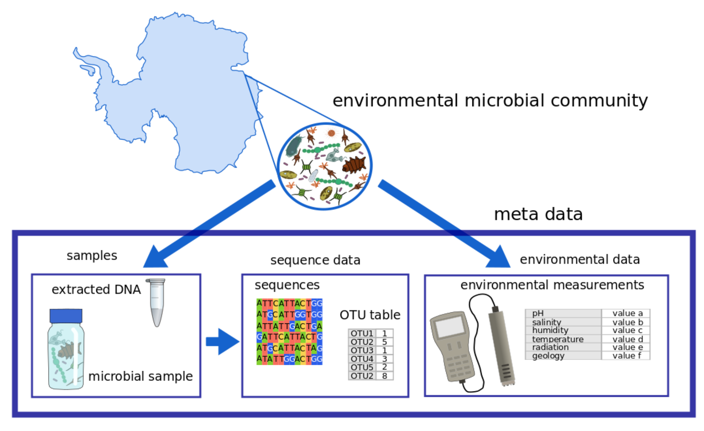
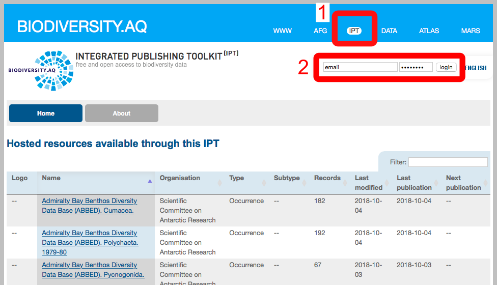
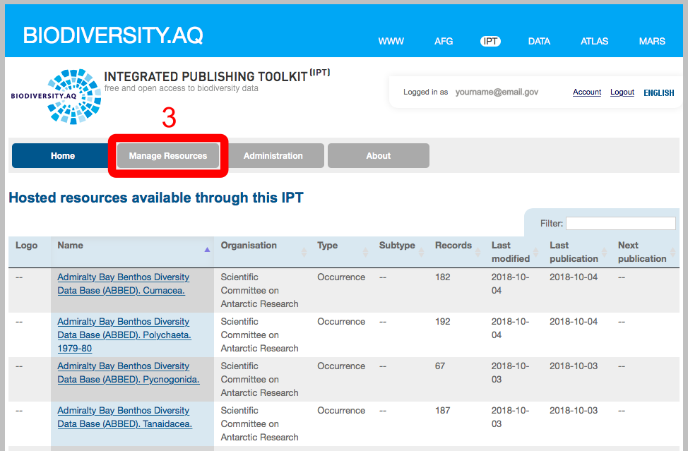
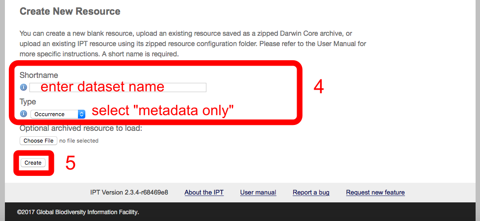
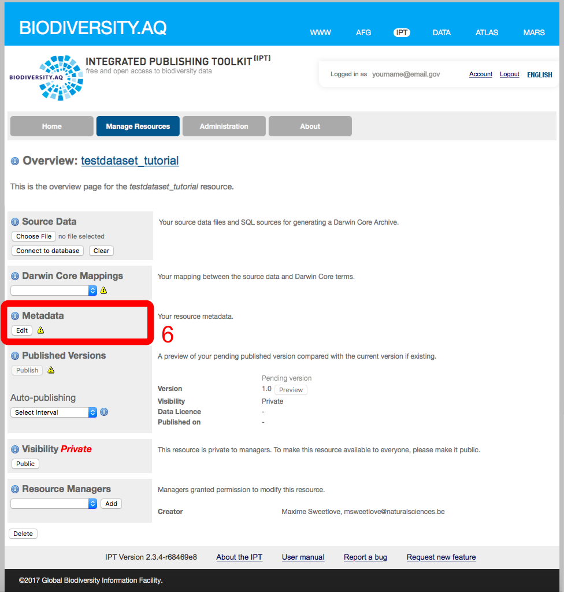
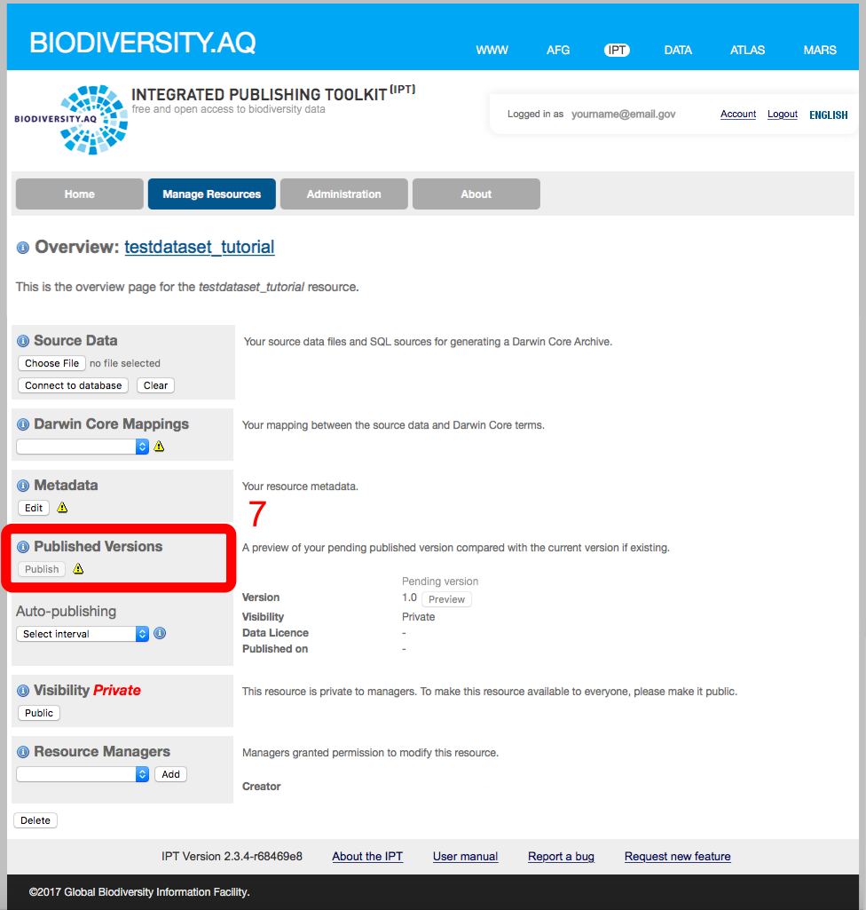
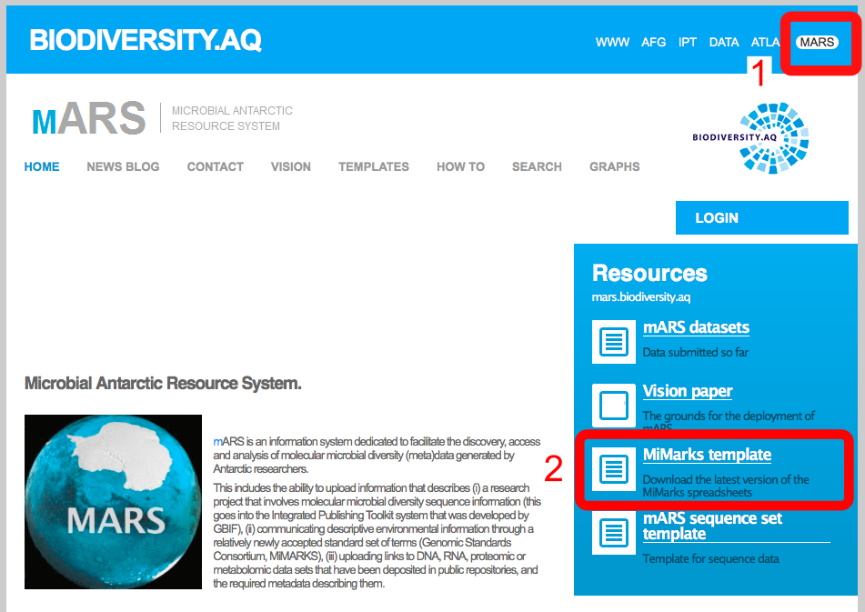
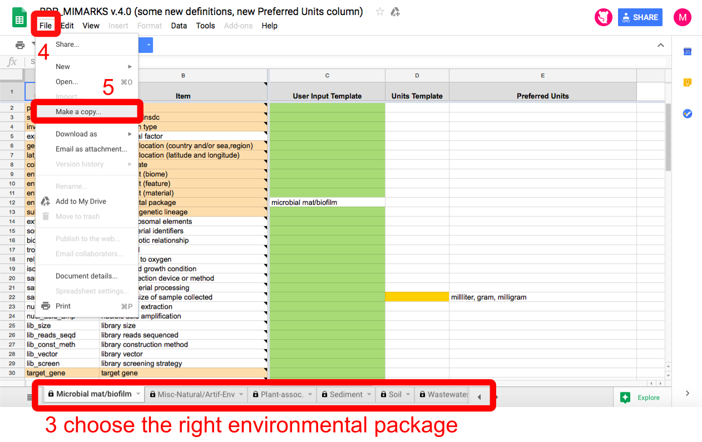

Note: if you want to get started immediately, go to "about this SOP".

##Why use mARS?
The microbial Antarctic Resource System (mARS) is an online platform that aims to support biological research in on the Antarctic continent and the Southern Ocean (or other cryo-environments) by creating a central hub where data of past and present projects become discoverable and exchangeable to the Antarctic scientific community and beyond. Key to this is collecting and archiving metadata, and annotating geographic environmental physio-chemical measurements to biological sequence data that is represented on the nucleotide databases of INSDC[^1] (e.g. SRA and ENA), using internationally standardized vocabularies. In addition, all Antarctic microbial datasets that are represented in mARS are also published on GBIF (the Global Biodiversity Information Facility). 

[^1]: INSDC = the International Nucleotide Sequence Database Collaboration is a long-standing foundational initiative that connects the Europe's EMBL-EBI, the United State' NCBI and Japan's DDBJ  databases for DNA, RNA and protein sequences.

Once represented on mARS, the annotated data can be found and mined through various query functions or the dynamic geographical map figure on the main page.

Importantly, mARS also supports a phased approach, in which data can be submitted in a step-wise fashion. Like this, very basic metadata about a research project can be published on mARS early on, while environmental and sequencing data can be added at the end of the project when all manuscripts have been accepted for publication.

Thus, by documenting your projects and data on mARS, you create visibility of your work in the wider Antarctic community, safeguard your data in a contextual framework for future research and contribute to open science in true spirit of the Antarctic Treaty.

More information on the vision of mARS can be found [here](http://share.biodiversity.aq/MARS/Vision/mARSVision.pdf).

##Representing microbial datasets on mARS

This section shortly clarifies the complex data structure of microbial datasets, on how mARS deals with this.

 

 

Scientific studies that focus on microbial diversity and ecology often generate complicated datasets that are composed of various types of data. These can be categorized into three classes, being 1) sequencing data, 2) measurements on the physical and chemical properties of the environment, and 3) contextual metadata, like the experimental procedures by which the sequencing and environmental data was generated. Each of these three classes of data has their own digital requirements, utilities and limits, but each is also crucial to a correct understanding of the other data classes of a research project.

The sequencing data encloses all DNA, RNA or protein sequences that were deciphered using laboratory analyses, and typically serves as a proxy for the community composition or the genomic/transcriptomic/proteomic makeup of the microbial organisms that were found in the sample. Second, the environmental data encloses all chemical and physical measurements that were taken to characterize the conditions under which the sample was originally found. These can include geographic coordinates, temperature, pH, ion measurements, etc. This, however, should not be confused with metadata. Metadata is perhaps most often overlooked, but of crucial importance. This includes all contextual information surrounding a sample and how it was analyzed, such as the expedition when the sample was taken, the person who took it, but also the protocol how DNA or RNA was extracted and sequenced. Although without this information the value of sequencing and environmental data significantly drops, it is often incompletely documented or difficult to retrieve from data on the INSDC nucleotide databases.

In mARS, only the environmental data and metadata are stored. MARS will not store sequence data itself. it is intended that the sequence data produced by your project is submitted to a public repository of INSDC, such as the European Molecular Biology Laboratory (EMBL), the National Center for Biotechnology Information (NCBI) or the DNA Databank of Japan (DDBJ). Using unique sample IDs and the sequence accession numbers from INSDC (e.g. SRA accession number, BioProject number, BioSample number,???), environmental- and metadata are linked to the sequencing data that is represented on one of the INSDC nucleotide databases.

##About this SOP

This SOP details how you can upload your project meta- and environmental data to the microbial Antarctic Resource System (mARS). As mentioned earlier, the sequence data produced by your project cannot be stored on mARS, but should be submitted to a public repository of INSDC (but see further). Instead, mARS aims to collect meta- and environmental data, which enables different projects to be searched and filtered more easily than on the public nucleotide sequence repositories. To ensure the procedure of gathering all your meta- and environmental data only has to been carried out once, the mARS team has devoted special care to following widely-used standards for biodiversity data, as promoted by the [Global Biodiversity Information Facility (GBIF)](https://www.gbif.org) and the [Genomics Standards Consortium](https://press3.mcs.anl.gov/gensc). In this particular case, this SOP is built around two main types of standards, namely [DarwinCore](https://code.google.com/archive/p/gbif-providertoolkit/wikis/DarwinCore.wiki), and the [Minimum Information on any Sequence (MIxS)](http://wiki.gensc.org/index.php?title=MIxS) standard (where the Minimum Information about a MARKer gene Sequence (MiMARKS) has been designated). This ensures maximal interoperability with internationally recognized data and metadata repositories.

There are two main steps during which meta- and environmental data can be committed to mARS. These roughly correspond with different phases in the life-cycle of a research project, and can be done at different time points.

In a **first step**, the project together with basic metadata can be registered through an interface with GBIF, using standardized DarwinCore terminology. At present, GBIF is mainly intended to accept occurrence data for macrorganism biodiversity datasets, and can NOT accept molecular sequence-derived OTU occurrence data sets. Therefore, mARS implements custom data system, in which the product (the project metadata) is discoverable across GBIF and mARS; while the latter also encloses the  environmental data (see second step) as well as a link to the accompanying sequence data. 

The **second step** typically accompanies the later phases of a research project, when sequence data has been generated and analyzed. For this, we are requiring that the sequence data is accessible in a public repository (ENA, Genbank, SRA, or other web-accessible sites). In most cases, like with high throughput sequencing datasets, the public repository will require a MiMARKS spreadsheet to be filled in  ([Yilmaz et al. 2011](https://www.nature.com/articles/nbt.1823)). This file will contain valuable technical data on the samples and how they were sequenced, as well as all any environmental parameters that were gathered, using standardized ontologies and measurement units. This MiMARKS file is required to make your data discoverable on the mARS portal. If your sequence data has not yet been submitted to a public repository, an empty MiMARKS spreadsheet can be completed via mARS, and can later be used to save time when uploading your sequence data to a public repository. 

**Finally**, MARS also requires a the "Microbial sequence set spreadsheet" to be filled in, which summarizes additional sequence-related information, and allows us to access and represent sequence data you have published in open repositories.

To upload your project information, environmental data, and sequence-related information simply follow the step-by-step procedure below. If you have any difficulties, don't hesitate to [get in touch with us](http://mars.biodiversity.aq/site_pages/contact).

##SOP, Step by step

###0. Before you start
1.	Send an email to request a username and password from the IPT administrator (avandeputte [at] naturalsciences.be).
2.	Get a google login if you don't already have one - to access and copy the two template files that you need. The templates - and precise data formats that are required are defined and explained in these templates. 
3.	Make a copy or download the [MiMarks Googlesheet](https://docs.google.com/spreadsheets/d/1eeYQUewvIdOj9C932zZ6ghez-1F-U0RnvGnQEXu3p2w/edit?authkey=COanrdEC&authkey=COanrdEC#gid=5) from the RDP MiMarks Googlesheet that we have a link to here (click on "Make copy" or "from the "File" menu). If you cannot access Google Documents, get in touch with us. 
4.	Make a copy of the [Microbial Sequence Set file](https://docs.google.com/spreadsheets/d/1GPq5END4wgOIuZdnfRcVeSdtoQ-uRNLhJ7yTTXbo9oA/pub?output=html) from the mARS Googlesheet (click on "Make copy" from the "File" menu). If you cannot access Google Documents, get in touch with us. 

###1 project metadata
####1.1. Describe your project in the IPT (the metadata)
1.	Login to the [Integrated publishing toolkit (IPT)](https://ipt.biodiversity.aq) at biodiversity.aq using your credentials. This tool will guide you step by step through the procedure to publish your metadata, and uses the standardized terms and ontologies of DarwinCore to document your dataset.

 

 
2.	After logging in, the "Manage Resources" tab will appear at the top of the page. Click on manage resources.
 
 

 
3.	Use the form at the bottom of the "Manage Resource" page to create a new resource. Provide a unique "shortname" for your dataset. Under "Type" select "Metadata only" or "Other"; at this point, the IPT, which is affiliated with GBIF is not designed to take environmental or molecular diversity information. Click the "Create" button. 
 
 

 
4.	This will send you to the Resource Management page, where you can Click on the "Edit" button in the Metadata section on the left and fill in the details for the different metadata sections. A detailed instructions are available from [IPT quick reference guide](https://code.google.com/archive/p/gbif-providertoolkit/wikis/IPT2ManualNotes.wiki#Quick_Reference_Guide). Hint: mention your grant number in the "Project Data" section, to allow us to link your resource to relevant projects in the GCMD/AMD.
 
 

 
Next, the IPT website will guide you step by step through the procedure of documenting and publishing your metadata. Highly detailed instructions are also available from [IPT quick reference guide](https://code.google.com/archive/p/gbif-providertoolkit/wikis/IPT2ManualNotes.wiki#Quick_Reference_Guide). "*" signifies fields that need to be filled out. Don't forget to save the queries regularly, which can be done at the bottom of each page.
 
 

 
 => getting help
Also see "Section" menu on the right

**Tips and help for filling out the IPT forms:**
* There's a navigation bar to the right with various forms that require information 
* Basic Metadata sheet: 
    + under "Title" enter a descriptive title for your project
    + under "Description", describe the content of the dataset. Mention targeted groups, marker genes used or geographical regions covered.
* Temporal Coverage sheet:
    + you can either enter specific sample seasons or dates if you have few samples, or if a long term project, then enter the complete date range.
* Keywords: 
    + You can enter "n/a" in the Thesaurus Vocabulary box. Enter Keywords that can be used to find your project.  This will be searchable in GBIF among other search engines.
* Associated Parties sheet:
    + Here diverse associated parties can be added that are not among the resource creators. This page can be left blank if all associated parties are already represented in the "Basic Metadata" sheet.
* Project data:
    +  Grant numbers and other important project information can be mentioned here. This also allow mARS to link the resource to relevant projects in the GCMD/AMD. For projects that are in their early stages, this information can help increase the visibility and discoverability of a project, and can be interesting for further collaboration with other research groups.
* Collection data: 
+ These terms don't apply to the mARS data sets perfectly; though you can still enter relevant terms for your data. This data is particularly relevant if you do have archived samples or cultures either in your lab or in the DNA archive in New Zealand. Enter Not Applicable where appropriate.
* External Links: 
    + This is a good place to put the URL for a project website if you have one.
* Additional Metadata: 
    + If your data set is registered in other data bases (e.g. Antarctic Master Directory; GenBank or the Sequence Read Archive, BCO-DMO) then enter that information here. 

####1.2. Publish and register your metadata
1.	Back in the main IPT webpage, from your Resource Management page (you can go there by clicking on your resource title), click on the "Publish" button in the "Published release" section on the left of the page. This action will upload your project metadata (and only the metadata) to the MARS portal. Do not worry when you see a warning message "Source data or Darwin Core mappings missing. No data archive generated". Please note that this is perfectly normal if you are publishing a metadata-only resource. Generating a DarwinCore archive requires also to upload file with occurrence data that is mapped to DarwinCore terms, and is combined with the metadata. This, however, is currently not yet possible for microbial data.
 
 

 
2.	By default, your resource's visibility is set to "Private". To allow your resource to become visible on the IPT for all users, click on the "Public" button in the "Visibility" section.
3.	Send an email to one of the mARS data administrators to request final "registration" of your data set. Registration differs from publishing in that this will allow your metadata to be discoverable through online biodiversity information networks, including GBIF. Your data set receives a stable, unique identifier on the web.

###2 Environmental data
####2.1. Prepare your MiMarks spreadsheet (environmental data and sequencing metadata)
1.	If your sequence data has been deposited on SRA or ENA, and you have the filled in MiMarks spreadsheat as a comma separated file (CSV) at hand, you can immediately go to step 2.2, uploading your MiMARKS CSV.
 
 

 
2.	If your sequence data has not yet been deposited on SRA or ENA, then fill in your environmental data details in the [MiMarks Googlesheet](https://docs.google.com/spreadsheets/d/1eeYQUewvIdOj9C932zZ6ghez-1F-U0RnvGnQEXu3p2w/edit?authkey=COanrdEC&authkey=COanrdEC#gid=5) you've created in step 0. The Google Documents" interface can be used for this, and instructions are available from the [MiMarks Googlesheet documentation at RDP](http://rdp.cme.msu.edu/misc/googleSheetsHelp.jsp). Example files are available from the mARS website. The MiMARKS specifications were designed by the Genomic Standards Consortium (GSC) to capture the most fundamental (hence "minimum") information that should accompany a set of sequences ([Yilmaz et al., 2011](http://www.nature.com/nbt/journal/v29/n5/pdf/nbt.1823.pdf)). MiMARKS also allows to document any other ancillary information (e.g. environmental parameters) that are available using internationally standardized units and terminology. There are several slightly different variants of the MiMARKS template, which represent different environments from which your samples can be taken (e.g. soil, lake water, human skin, etc.). These variants are referred to as "packages", and differ in some terms that are unique to the environment it represents. They can be found as individual spreadsheets in the MiMARKS file. Only the spreadsheet of the most appropriate package for your dataset needs to be completed.
By completing the MiMARKS template using standardized ontology terms, your environmental data can be coupled to the different sequence samples, and become comparable and interchangeable with other projects.
3.	In the header for each column that will hold your unique identifier of your sequence data sample (i.e. sample name). Note that only one environmental package (i.e. spreadsheets) must be completed, in accordance with the origin of the samples.
 
 

 
**Tips and help for filling out the MiMARKS forms:**
* MiMARKS uses standardized onthologies, which means that for some fields, only a limited number of stringently defined terms can be provided as user input. 
* For every field, the desired or allowed input can be checked by clicking on the explanation in the "item" column. User content should be provided in the green column ("User Input Template"), while data from different samples can be filled in different columns, one next to the other. 
* At the end, the "Units Template" can be used to specify the measurements units where necessary (i.e. yellow fields). In the final version version of your template, this unit column can be put up front. The term "Alphanumeric" can be used for fields without a specific unit.
* Provide as much information that you can. By no means all fields need to be filled in. 
* Data that does not fit any of the proposed terms can be added using a self-defined row name. In that case, add an extra column up front to indicate if a term was part of MiMARKS or self-defined (write: "miscellaneous" in the latter case).
* Fields can be filled in by copy-pasting values or columns from your original environmental data file. Note that the format of MiMARKS at this point seems somewhat counter-intuitive, with samples as columns, and parameters as rows. Therefore, feel free to transpose the MiMARKS template to better fit the way your environmental data is stored (which is commonly a matrix with samples as rows, and parameters as columns).
* use "." as decimal separator
* avoid non-numeric and non-alphabethic characters (e.g. /,-,+,*,\ etc.) if not explicitly specified in the description of the field. Use a space (" ") to separate values within a field.
* Write latitude and longitude as WSG84 decimal coordinates, separated by a space.

4.	Once you are finished, download your spreadsheet as a CSV (Comma-separated Values) file on your computer.

####2.2. Upload your MiMarks CSV(s) in mARS [Still in DEV]
For now just mail us your Mimarks and Microbial Sequence set as a comma separated file (CSV), which can, for instance, be obtained by using the 'save as' function under the file menu in Excell.

###3 additional sequencing metadata
####3.1. Prepare your Microbial Sequence Set spreadsheet
1.	In the Microbial Sequence Set Googlesheet you've created in step 0, fill all the fields (replace the examples available from the Googlesheet). As this information is currently not presented in the MiMARKS format, we designed a separate file ("sequence set template") in which this information can be provided. In this, we define a sequence set as the digital library of sequences that originated from a single environmental sample. So, a sequence set corresponds to the sequences obtained from one DNA extract of a sample. Like with the MiMARKS template, fill is as much fields as you can, but by no means to all fields need to be filled in.
2.	Once you are finished, download your spreadsheet as a CSV file on your computer.

####3.2. Upload your Microbial Sequence Set CSV(s) in mARS [Still in DEV]
For now just mail us your Mimarks and Microbial Sequence set CSV as a spreadsheet (eg. excel) 

###4. You're done, go shopping or bar hopping!
1.	Get in touch with us when you've gone through the process.
2.	Do you need a GCMD/AMD identifier? Send us an email, and we'll sort that out for you.

###5. You realize you made a mistake, or want to update the IPT
1. You can edit any field. Log into the IPT, go to manage resources overview, change the fields that you want to change. Go to the Published Release box on the left panel and hit "publish" again. 
2. You must email the mARS administrator to notifiy them of your update.

###References/links:
[Yilmaz P., R. Kottman, D. Field, R. Knight, J. R. Cole, L. Amaral-Zettler et al. (2011). The "Minimum Information about a MARKer gene Sequence" (MIMARKS) checklist: Capturing contextual data about marker gene sequences and introducing MIxS, a unified standard for sequence checklist development including environmental data. Nat Biotechnol.](http://www.nature.com/nbt/journal/v29/n5/pdf/nbt.1823.pdf)

[DarwinCore](https://code.google.com/p/gbif-providertoolkit/wiki/DarwinCore)

[MiMarks Wiki](http://wiki.gensc.org/index.php?title=MIMARKS)

[MiMarks Googlesheet documentation at RDP](http://rdp.cme.msu.edu/misc/googleSheetsHelp.jsp)

[IPT quick reference guide](https://code.google.com/p/gbif-providertoolkit/wiki/IPT2ManualNotes#Quick_Reference_Guide)

[mARS white paper](http://marswhitepaper.blogspot.be)

[mARS FAQs](http://mars.biodiversity.aq/howto)

[Global Change Master Directory](http://gcmd.nasa.gov)

[Antarctic Master Directory](http://gcmd.gsfc.nasa.gov/KeywordSearch/Home.do?Portal=amd&MetadataType=0)
